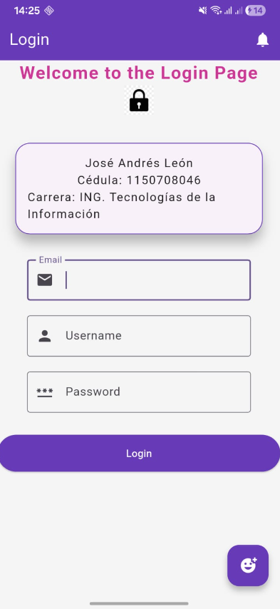

# andres_s1

# Jose Andrés León

Actividad 2.1. Gestión de la práctica y experimentación
Tarea numero 1 de programación móvil 

Configuración del entorno, despliegue y personalización avanzada de una app Flutter

